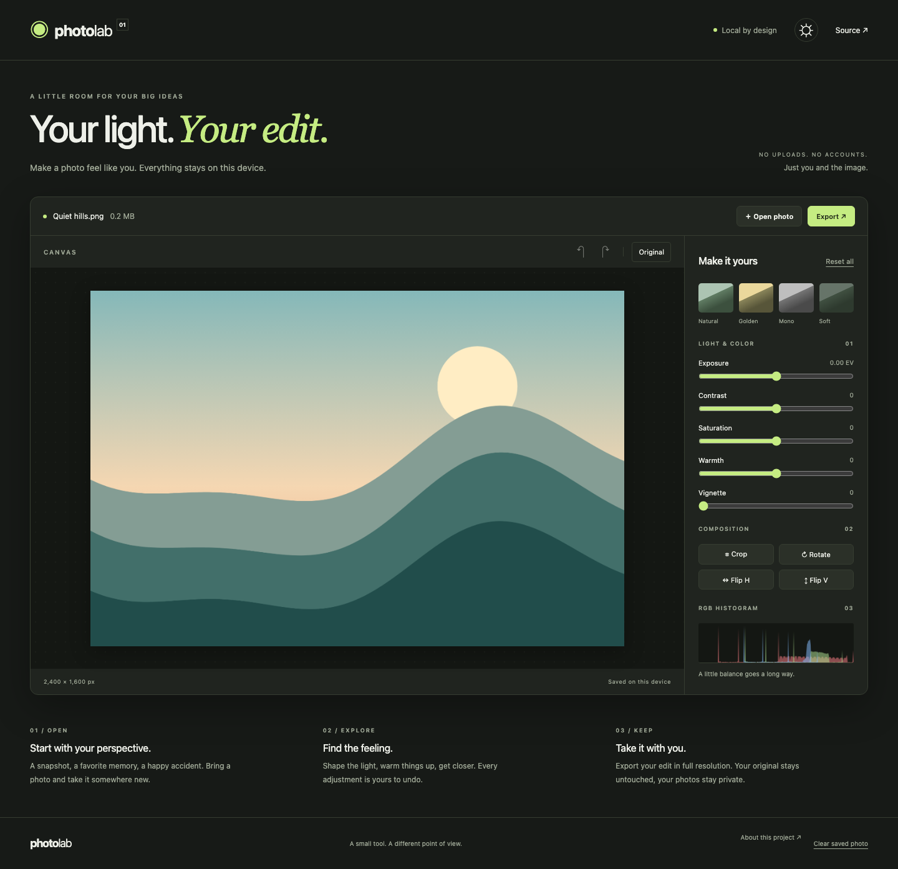

# Photo Lab

A private photo studio in your browser. Open a photo, find the right crop and color, then export a new file. No account, no upload, no backend.

**[Open Photo Lab](https://mrnednick.github.io/photo-lab/)**



## What you can do

- Open JPEG, PNG, WebP or AVIF files with the file picker or drag and drop. Try the built-in landscape without bringing a photo.
- Crop with five aspect-ratio presets, resize and move the crop frame, rotate in 90° steps, and flip either axis.
- Adjust exposure, contrast, saturation, warmth and vignette, or start with Natural, Golden, Mono and Soft looks.
- Compare with the original. Undo and redo up to 100 edit states with buttons or `Ctrl/⌘ Z` and `Ctrl/⌘ Shift Z`.
- Export JPEG with adjustable quality, or lossless PNG with transparency, at full resolution or a smaller size. Cancel an export while it is running.
- Resume the latest photo and edit history after a reload. Tabs share the same workspace; the last completed save wins.
- Use light or dark mode, a 360 px phone layout, or a full keyboard workflow. The crop frame moves with arrow keys; Shift makes larger steps.

Your original file is never overwritten. Crop coordinates refer to the original, before rotation. Only the latest workspace is saved; opening another photo replaces it.

## Why this stack

TypeScript and Vite keep the interface small without a UI framework. The project has no runtime package dependencies. The browser already provides the specialist tools this editor needs:

| Work                                         | Where it runs                                                         |
| -------------------------------------------- | --------------------------------------------------------------------- |
| Controls, history and save coordination      | Main thread                                                           |
| Preview filters and geometric transforms     | WebGL2, one fragment-shader pass                                      |
| Image decode and preview downsampling        | Web Worker with `createImageBitmap`                                   |
| RGB histogram                                | Worker, rendered at 256 px and refreshed at most ten times per second |
| Full-resolution render and PNG/JPEG encoding | Dedicated worker using WebGL2 and `OffscreenCanvas`                   |
| Original blob and edit history               | IndexedDB on this browser                                             |

The preview texture is capped at 2048 px. Rendering follows the visible canvas size, capped at a 1600 px longest edge, instead of processing all twelve million pixels on each slider movement. Export decodes the original and uses the same shader at the requested resolution. Cancelling terminates the dedicated export worker, including pending decode and encoding work.

`src/model.ts` contains geometry and history, `src/renderer.ts` owns GPU resources, `src/photo.worker.ts` handles background jobs, `src/storage.ts` isolates IndexedDB, and `src/main.ts` connects the accessible controls to them.

## Measured performance

A production-build run with a generated 4000 × 3000 JPEG, Chromium 153 on macOS, default GPU backend, 1440 × 1000 viewport:

| Measurement                                                |   Result |
| ---------------------------------------------------------- | -------: |
| Decode, preview preparation and texture upload             |   107 ms |
| Animation-frame cadence during continuous exposure changes | 60.0 fps |
| 95th-percentile frame interval                             |  16.7 ms |
| Full-resolution JPEG export                                |   506 ms |

These are one machine's measurements, not a guarantee for every photo or GPU. Opening time ends at texture upload, before the first screen paint. Frame cadence is measured with `requestAnimationFrame`, rather than a hardware presentation counter. A separate software-rendering run before the viewport-size optimization achieved approximately 19 fps; acceleration and preview size matter.

[Raw benchmark](docs/benchmark.json) and the repeatable workload live in `tests/performance.spec.ts`. The tests also check that the event loop continues during export and that cancellation works.

Lighthouse against the local production build scored **100 performance / 100 accessibility / 100 best practices / 100 SEO** on the initial workspace. These scores describe that run and state, not a loaded-image benchmark.

## Run locally

Use Node 22.12+; CI uses Node 24.

```sh
npm ci
npm run dev
```

Open the URL printed by Vite, including `/photo-lab/`.

```sh
npm run lint          # TypeScript and unused-code checks
npm test              # 12 unit and accessible-UI tests
npm run build
npx playwright install chromium
npm run test:e2e       # Editing, export pixels, persistence, layouts, 12 MP workload
npm run format:check
```

For the recorded production benchmark, start `npm run preview` and run:

```sh
HARDWARE_GRAPHICS=1 RECORD_METRICS=1 \
  PLAYWRIGHT_BASE_URL=http://127.0.0.1:4173/photo-lab/ \
  npx playwright test tests/performance.spec.ts
```

Without `HARDWARE_GRAPHICS`, browser tests use SwiftShader for consistent headless CI. `RECORD_METRICS` also updates the screenshot. Tests cover broken-image recovery, undo/redo branching, crop/rotation sizes, cross-tab updates, PNG dimensions and pixel variation, zero external requests during editing, and both themes at 360, 768 and 1440 px. A deliberate crop-geometry mutation was detected by five unit tests.

## Deploy

GitHub Pages is configured to use GitHub Actions. A push to `main` installs dependencies, runs checks, builds `dist/` and deploys it. The separate Checks workflow also runs the browser tests. To redeploy the current version:

```sh
gh workflow run pages.yml
```

To host elsewhere, build with `npm run build` and serve `dist/`. Set Vite's `base` in `vite.config.ts` to the host's path (use `/` for a domain root).

## Privacy and limits

Photo bytes are never sent to a server. There are no analytics, remote fonts or external image requests. A content security policy restricts connections to the app's own origin. Hosting still receives ordinary requests for HTML, JavaScript and CSS, but never the opened photo.

IndexedDB is local browser storage, not encrypted storage or a backup. Use **Clear saved photo** to remove the saved workspace, especially on a shared device. A browser quota or private-mode restriction can prevent persistence; editing and export remain available with a visible warning.

A current browser with WebGL2, OffscreenCanvas and worker image decoding is required. Inputs are limited to 50 MB and 50 megapixels; full-resolution export is also limited by the device's maximum GPU texture size and available memory. RAW and HEIC are not supported. This is an SDR editor using browser color handling, not a color-managed RAW development tool. PNG preserves transparency; JPEG cannot. Exported files do not retain the original metadata.
