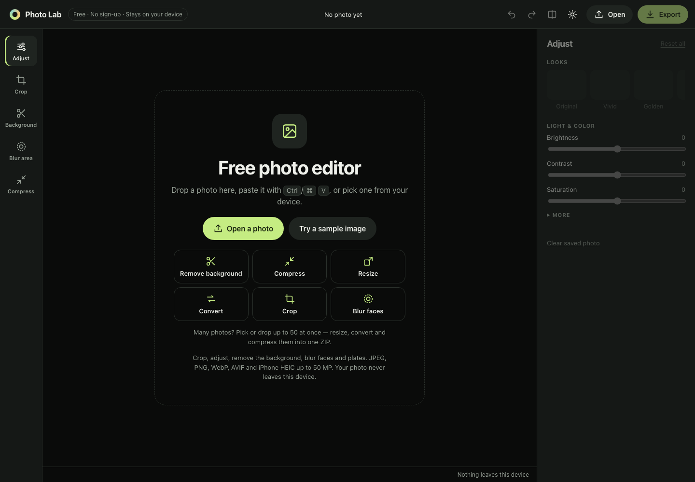

# Photo Lab — free image tools

Remove the background, compress, resize, convert. No sign-up, nothing uploaded.

| I want to…                                                                        | Opens straight into                                                              |
| --------------------------------------------------------------------------------- | -------------------------------------------------------------------------------- |
| [Remove the background](https://mrnednick.github.io/photo-lab/remove-background/) | a cut-out for people or objects — transparent, a colour or a soft blur behind it |
| [Compress a photo](https://mrnednick.github.io/photo-lab/compress/)               | the best quality that fits 100 KB, 500 KB, 1 MB or your own size                 |
| [Resize a photo](https://mrnednick.github.io/photo-lab/resize/)                   | 1080 px for social media, 2048 px, a percentage or an exact width                |
| [Convert a photo](https://mrnednick.github.io/photo-lab/convert/)                 | iPhone HEIC, PNG, WebP or AVIF to JPEG, PNG or WebP                              |
| [Crop a photo](https://mrnednick.github.io/photo-lab/crop/)                       | Instagram 1:1 and 4:5, Stories 9:16, YouTube 16:9, A4 — and a straight horizon   |
| [Blur faces and plates](https://mrnednick.github.io/photo-lab/blur/)              | blur or pixels over anything that should not be shared                           |

Up to 50 photos at once: pick or drop them together to resize, convert and compress them into one ZIP.


**Why:** the everyday image jobs should not need an account, an upload or a watermark — so everything here runs on your own device.

## What else is in the editor

- **Open** JPEG, PNG, WebP, AVIF or iPhone HEIC — pick, drop or paste with `Ctrl/⌘ V`. There is a sample photo if you just want to look around.
- **Adjust** brightness, contrast and saturation, or start from one of seven looks previewed on your own photo; warmth and vignette are under **More**.
- **Straighten** a tilted horizon by up to 45° without empty corners, rotate in quarter turns, mirror.
- **Refine a cut-out** with the Keep and Erase brush, and soften its edge.
- **Compare** with the original by dragging a divider, or hold `Space`.
- **Export** JPEG, PNG or WebP (AVIF where the browser encodes it), copy to the clipboard or share from a phone.
- **Pick up where you left off:** the photo and 100 steps of undo survive a reload and stay in step across tabs.

Light and dark themes, a 360 px phone layout and full keyboard use.



## Everything stays on your device

The photo never leaves the browser. Background removal is a small neural network ([U²-Net-p](https://github.com/xuebinqin/U-2-Net), Apache-2.0) run by [ONNX Runtime Web](https://onnxruntime.ai/) in a worker. It is served from this site and downloaded only when you first ask for a cut-out: the 4.6 MB model plus a 3.7 MB (gzip) runtime, cached after that. On a laptop, the first cut-out takes about 2 seconds, download included.

iPhone HEIC photos are converted to a high-quality JPEG on open. Safari reads them itself; other browsers fetch the [libheif](https://github.com/strukturag/libheif) decoder (LGPL-3.0, unmodified [libheif-js](https://github.com/catdad-experiments/libheif-js) build) as a separate module — only when a HEIC file arrives.

The model is deliberately small, so its rough answer is cleaned up afterwards: only the main subject is kept (stray pieces of the background go), the edge snaps to the real edge of the photo with a guided filter, objects get a firm edge and people keep soft hair. A busy street can still confuse it; the brush fixes what it gets wrong.

## How it is built

TypeScript and Vite, no UI framework. The browser already has the specialist parts an editor needs:

| Work                                                    | Where it runs                                                   |
| ------------------------------------------------------- | --------------------------------------------------------------- |
| Controls, history and save coordination                 | Main thread                                                     |
| Colors, geometry, horizon, background and hidden areas  | WebGL2, one fragment-shader pass                                |
| Image decode and look previews                          | One long-lived worker with its own WebGL2 context               |
| Background cut-out and its clean-up                     | Worker running ONNX Runtime Web (WebAssembly), loaded on demand |
| Full-resolution render, encoding, size-targeted quality | Dedicated export worker with `OffscreenCanvas`, cancellable     |
| HEIC decoding                                           | Separate worker, decoder fetched only for HEIC files            |
| Batch of up to 50 files → ZIP                           | One export worker per file, in sequence; ZIP written in-house   |
| Original photo, cut-out mask and edit history           | IndexedDB in this browser                                       |

Every edit is a small serializable record, and the preview and the export are the same shader at different sizes, so what you see is what you get. Tools that draw on the preview — hidden areas — are stored in original-photo coordinates by running the shader's mapping backwards (`sourcePoint` in `src/model.ts`), so they stay on the right pixels after a later crop or rotation. Workspaces saved by the first version of the editor open unchanged.

`src/model.ts` holds geometry and history, `src/renderer.ts` the GPU pass, `src/photo.worker.ts` and `src/segment.worker.ts` the background work, `src/storage.ts` IndexedDB, and `src/main.ts` the interface.

## Measured performance

A production build with a generated 4000 × 3000 JPEG, Chromium 153 on macOS, default GPU backend, 1440 × 1000 viewport:

| Measurement                                                |   Result |
| ---------------------------------------------------------- | -------: |
| Decode, preview preparation and texture upload             |   105 ms |
| Animation-frame cadence during continuous exposure changes | 60.0 fps |
| 95th-percentile frame interval                             |  16.7 ms |
| Full-resolution JPEG export                                |   504 ms |
| First background cut-out, model download included          |   ~1.7 s |

One machine's numbers, not a promise for every photo or GPU. The preview texture is capped at 2048 px and rendering follows the visible canvas size, so moving a slider never processes all twelve million pixels. [Raw benchmark](docs/benchmark.json); the repeatable workload lives in `tests/performance.spec.ts`.

## Run locally

Node 22.12+; CI uses Node 24.

```sh
npm ci
npm run dev
```

Open the URL Vite prints, including `/photo-lab/`.

```sh
npm run lint          # TypeScript
npm test              # 31 unit and interface tests
npm run build
npx playwright install chromium firefox webkit
npm run test:e2e      # editing, background removal, export pixels, persistence, layouts, 12 MP workload
npm run test:matrix   # every tool on Chromium, Firefox and WebKit at 360 and 1440 px
npm run format:check
```

Browser tests use SwiftShader unless `HARDWARE_GRAPHICS` is set, so they run the same in headless CI. They check exported pixels and dimensions, a transparent PNG after background removal, cross-tab updates, broken-file recovery, no requests to other hosts, and both themes at 360, 768 and 1440 px. To record the benchmark, run `npm run preview` and:

```sh
HARDWARE_GRAPHICS=1 RECORD_METRICS=1 \
  PLAYWRIGHT_BASE_URL=http://127.0.0.1:4173/photo-lab/ \
  npx playwright test tests/performance.spec.ts
```

## Deploy

GitHub Pages via GitHub Actions: a push to `main` runs the checks, builds `dist/` and deploys it. To redeploy by hand, `gh workflow run pages.yml`. Elsewhere, serve `dist/` and set `base` in `vite.config.ts` to the host's path.

## Limits

A current browser with WebGL2, OffscreenCanvas and worker image decoding is required. Inputs are limited to 50 MB and 50 megapixels; full-resolution export is also bounded by the GPU's texture size and memory. RAW is not supported, and this is an SDR editor, not a color-managed RAW developer. JPEG has no transparency — the editor switches to PNG when the background is transparent. Exported files do not keep the original metadata.

IndexedDB is local storage, not a backup and not encrypted. **Clear saved photo** removes the workspace, which matters on a shared device.
