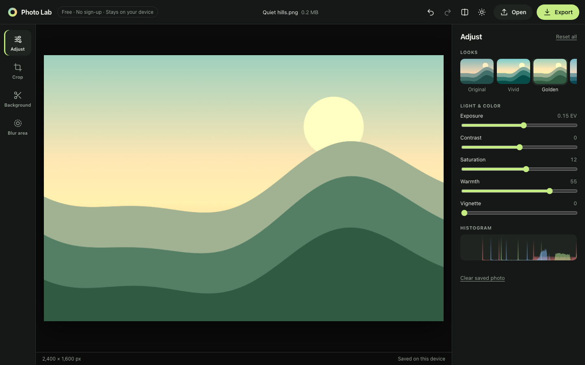

# Photo Lab

A free photo editor that runs entirely in your browser. Crop for Instagram or Stories, straighten the horizon, fix the colors, remove the background, blur a face or a number plate — and export. No sign-up, no upload, no watermark.

**[Open Photo Lab](https://mrnednick.github.io/photo-lab/)**



## What you can do

- **Open** a JPEG, PNG, WebP or AVIF photo — pick it, drop it on the page or paste it with `Ctrl/⌘ V`. The editor fills the window from the first second; there is a sample photo if you just want to look around.
- **Crop** with presets named for where the photo goes — Instagram post (1:1) and portrait (4:5), Stories (9:16), YouTube (16:9), print (3:2), A4 — or freely. Drag the frame or its corners; a rule-of-thirds grid helps.
- **Straighten** a tilted horizon by up to 45°. The frame zooms just enough that no empty corner ever shows. Rotate in quarter turns and flip either way.
- **Adjust** exposure, contrast, saturation, warmth and vignette, or start from one of seven looks, each previewed on your own photo.
- **Remove the background** with one click. Choose what goes behind the subject: transparency, a solid color, or a soft blur like a phone's portrait mode. If the cut-out missed or grabbed something, paint over it with the Keep or Erase brush.
- **Hide** faces, number plates or addresses with blur or pixelation before you share.
- **Compare** with the original by dragging a before/after divider, or hold `Space` for a quick look.
- **Export** JPEG, PNG or WebP (AVIF where the browser can encode it) at full size, a social-friendly 1080 px, a percentage, or an exact width. Copy the result to the clipboard or share it from your phone.
- **Pick up where you left off.** The photo and up to 100 steps of undo survive a reload and stay in step across open tabs.

Light and dark themes, a 360 px phone layout and full keyboard use are all supported.

## Everything stays on your device

The photo never leaves the browser. Background removal is a small neural network ([U²-Net-p](https://github.com/xuebinqin/U-2-Net), Apache-2.0) run by [ONNX Runtime Web](https://onnxruntime.ai/) in a worker. It is served from this site and downloaded only when you first ask for a cut-out: the 4.6 MB model plus a 3.7 MB (gzip) runtime, cached after that. On a laptop, the first cut-out takes about 2 seconds, download included.

The model is deliberately small, so it looks for the main subject in the frame: a person, an animal or a product on a calm background comes out cleanly, while a busy street can drag neighbouring objects into the cut-out.

## How it is built

TypeScript and Vite, no UI framework. The browser already has the specialist parts an editor needs:

| Work                                                   | Where it runs                                                   |
| ------------------------------------------------------ | --------------------------------------------------------------- |
| Controls, history and save coordination                | Main thread                                                     |
| Colors, geometry, horizon, background and hidden areas | WebGL2, one fragment-shader pass                                |
| Image decode, look previews and RGB histogram          | One long-lived worker with its own WebGL2 context               |
| Background cut-out                                     | Worker running ONNX Runtime Web (WebAssembly), loaded on demand |
| Full-resolution render and PNG/JPEG/WebP encoding      | Dedicated export worker with `OffscreenCanvas`, cancellable     |
| Original photo, cut-out mask and edit history          | IndexedDB in this browser                                       |

Every edit is a small serializable record, and the preview and the export are the same shader at different sizes, so what you see is what you get. Tools that draw on the preview — hidden areas — are stored in original-photo coordinates by running the shader's mapping backwards (`sourcePoint` in `src/model.ts`), so they stay on the right pixels after a later crop or rotation. Workspaces saved by the first version of the editor open unchanged.

`src/model.ts` holds geometry and history, `src/renderer.ts` the GPU pass, `src/photo.worker.ts` and `src/segment.worker.ts` the background work, `src/storage.ts` IndexedDB, and `src/main.ts` the interface.

## Measured performance

A production build with a generated 4000 × 3000 JPEG, Chromium 153 on macOS, default GPU backend, 1440 × 1000 viewport:

| Measurement                                                |   Result |
| ---------------------------------------------------------- | -------: |
| Decode, preview preparation and texture upload             |   105 ms |
| Animation-frame cadence during continuous exposure changes | 60.0 fps |
| 95th-percentile frame interval                             |  16.7 ms |
| Full-resolution JPEG export                                |   504 ms |
| First background cut-out, model download included          |   ~1.7 s |

One machine's numbers, not a promise for every photo or GPU. The preview texture is capped at 2048 px and rendering follows the visible canvas size, so moving a slider never processes all twelve million pixels. [Raw benchmark](docs/benchmark.json); the repeatable workload lives in `tests/performance.spec.ts`.

## Run locally

Node 22.12+; CI uses Node 24.

```sh
npm ci
npm run dev
```

Open the URL Vite prints, including `/photo-lab/`.

```sh
npm run lint          # TypeScript
npm test              # 17 unit and interface tests
npm run build
npx playwright install chromium
npm run test:e2e      # editing, background removal, export pixels, persistence, layouts, 12 MP workload
npm run format:check
```

Browser tests use SwiftShader unless `HARDWARE_GRAPHICS` is set, so they run the same in headless CI. They check exported pixels and dimensions, a transparent PNG after background removal, cross-tab updates, broken-file recovery, no requests to other hosts, and both themes at 360, 768 and 1440 px. To record the benchmark, run `npm run preview` and:

```sh
HARDWARE_GRAPHICS=1 RECORD_METRICS=1 \
  PLAYWRIGHT_BASE_URL=http://127.0.0.1:4173/photo-lab/ \
  npx playwright test tests/performance.spec.ts
```

## Deploy

GitHub Pages via GitHub Actions: a push to `main` runs the checks, builds `dist/` and deploys it. To redeploy by hand, `gh workflow run pages.yml`. Elsewhere, serve `dist/` and set `base` in `vite.config.ts` to the host's path.

## Limits

A current browser with WebGL2, OffscreenCanvas and worker image decoding is required. Inputs are limited to 50 MB and 50 megapixels; full-resolution export is also bounded by the GPU's texture size and memory. RAW and HEIC are not supported, and this is an SDR editor, not a color-managed RAW developer. JPEG has no transparency — the editor switches to PNG when the background is transparent. Exported files do not keep the original metadata.

IndexedDB is local storage, not a backup and not encrypted. **Clear saved photo** removes the workspace, which matters on a shared device.
